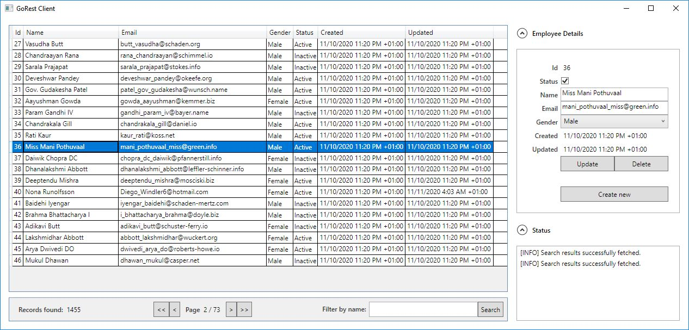

# GoRest Client



## Features

* Search employees by name
* Pagination (go to the first, previous, next, last page)
* Sort results (page) by field
* CRUD operations
  * Create a new employee record
  * Update employee record
  * Delete an employee record

## Prerequisites
[.NET Core SDK 3.1.403](https://dotnet.microsoft.com/download/dotnet-core/3.1)

## How to Run
The application can be built and run directly from Visual Studio, or from the console using the following .NET Core CLI:
```
  dotnet run --project ./GoRestClient/GoRestClient.csproj --configuration Release
```

## Technologies
*	.NET core 3.1 and WPF
*	[Prism](https://prismlibrary.com/) – For the MVVM implementation
*	[MS Unity Container](https://docs.microsoft.com/en-us/previous-versions/msp-n-p/ff647202(v=pandp.10)) – For dependency injection
*	[Json.NET](https://www.newtonsoft.com/json) – For JSON serialization
*	[NUnit](https://nunit.org/) – For unit tests
*	[Moq](https://github.com/Moq/moq4/wiki/Quickstart) – For mocking objects

All dependencies of the application are included as Nuget packages; therefore, they should be automatically restored during the build process.

## Solution Structure
* **GoRestClient** – MVVM implementation.
* **GoRestClient.Core** – Infrastructure classes that could, if necessary, be reusable in other projects.
  * **ConfigurationProvider** – Wrapper for the configuration manager to facilitate the DI and unit tests.
  * **JsonProvider** - Provider to centralize all Json related operations and configurations. Also, to facilitate DI and unit test of the static methods.
  * **RestProvider** – Provider responsible for executing all rest operations and handle requests/response contents.
  * **StatusManager** – Very simplistic implementation of a log/status manager. Just enough to meet the requirements of this exercise. 
* **GoRestClient.Services** – Implementation of the service, and required models, to interact with the API.
* **GoRestClient.*.Tests** – Each project has its own unit test project.

## Code coverage 
The code coverage index for this application is currently 89%. The unit tests are mainly focused on the most important classes/methods covering both, “happy path” and corner cases scenarios.

## Future improvements
The scope of this exercise is to be simple and right to the point .NET Core client for GoRest API. Some things are still missing or could be improved:
* Remove the Authentication Token from the config file.
* Include a data currency mechanism based on the timestamp of the records.
* Introduce a proper cache mechanism (according to the necessary requirements).
* Introduce a fault-handling (retry, circuit breaker, timeout) for the API requests.
* Implement fields data validation.
* Extend the search feature to the other properties.
* Improvements on the UI.
  * Create separated controls to improve reusability.
  * Add a loading control and “busy” state to avoid inconsistent/multiple requests.
  * General enhancements on the application layout.
